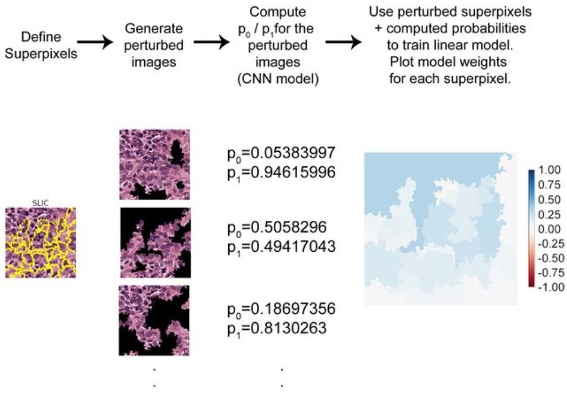

# Lime_Images
The main idea of LIME is to approximate the black box machine learning model locally (per sample) using a surrogate model. The surrogate model is a simple interpretable model.

Overview of the method :
1. Preprocess the image: Convert the image into a format suitable for processing. This may involve resizing, normalizing pixel values, and converting color channels if necessary.

2. Select the image to be explained: Choose the specific image you want to explain. It could be an image from your dataset or any image of interest.

3. Choose a prediction model: Select a machine learning model that was trained on a similar task or dataset. This model will be used to generate predictions for the image.

4. Generate perturbed samples: Create perturbed versions of the image by applying random transformations or perturbations. These perturbations should be applied to different parts of the image to understand their effect on the predictions.

5. Obtain predictions: Pass the perturbed images through the prediction model and collect the corresponding predictions for each perturbed sample.

6. Generate interpretable features: Convert the perturbed images and their predictions into interpretable features that can be understood by humans. This could involve extracting relevant features or transforming them into a more interpretable representation.

7. Train an interpretable model: Use the interpretable features and the corresponding predictions to train an interpretable model, such as a linear model or decision tree. This model should approximate the behavior of the prediction model on the interpretable features.

8. Explain the image prediction: Use the trained interpretable model to explain the prediction of the original image. This can be done by analyzing the contributions of different interpretable features to the final prediction.

9. Visualize the explanations: Present the explanations in a visually appealing and intuitive format. This could involve overlaying heatmaps on the original image to highlight the important regions or generating textual explanations describing the contributing features.

### I have implemented the method step by step and you can go throught the Lime_Images.py file to understand it deeply.

### Please refer to example.ipynb file for step by step implementation on custom images

